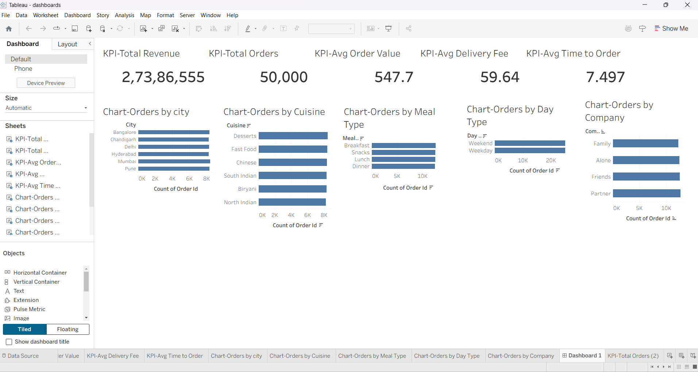

# 🍽️ Food Delivery Analysis Dashboard

## 📌 Project Overview

This project presents an interactive **Food Delivery Analysis Dashboard** built using **Tableau**.

The dashboard analyzes food ordering data to uncover customer ordering patterns, delivery performance, and business insights.

The goal of this project is to help restaurants and food delivery businesses make data-driven decisions by understanding customer preferences and operational performance.

---

## 📊 Dashboard Preview

## 📊 Dashboard Features

- 📦 Total Orders
- 💰 Average Order Value
- 🚚 Average Delivery Fee
- ⏱️ Average Time to Order
- 🍕 Orders by Cuisine
- 🌆 Orders by City
- 🍽️ Orders by Meal Type
- 🏢 Orders by Company
- 📅 Orders by Day Type

---

## 🛠️ Tools Used

- Tableau – Dashboard Development & Data Visualization
- Microsoft Excel / CSV – Dataset
- GitHub – Project Repository

---

## 🎯 Key Insights

- Identified the most popular cuisines among customers.
- Compared order trends across different cities.
- Analyzed meal preferences such as Breakfast, Lunch, Dinner, and Snacks.
- Evaluated delivery performance using average delivery time and delivery fee.
- Created KPI cards to summarize business performance.

---

## 📁 Files Included

- `Food_Delivery_Analysis.twbx` – Tableau Packaged Workbook

---
## 👩‍💻 Author

**Mohana Bhavya Vattikuti**

GitHub Repository: [Food_Delivery_Analysis](https://github.com/mohanabhavyavattikuti-214/Food_Delivery_Analysis)
